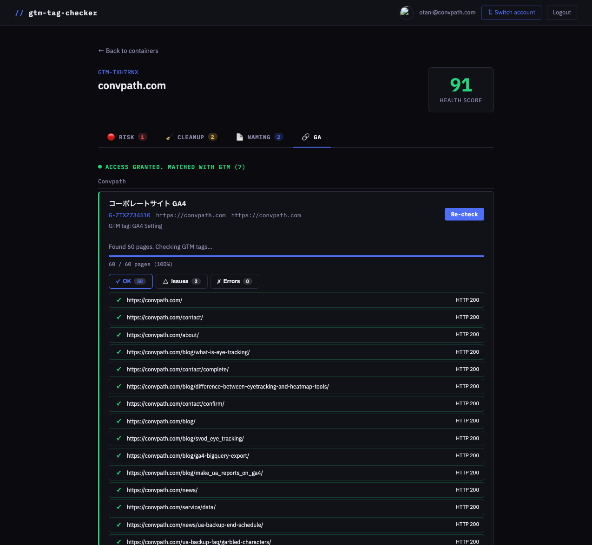

# GTM Tag Checker

A web app that audits Google Tag Manager container health via Google OAuth.

> Google OAuth でサインインして GTM コンテナの健全性を監査する Web アプリ



## Features

- **Risk** — Detects misconfigured or dangerous tags (e.g. tags without triggers, duplicate GA4 configs)
- **Cleanup** — Finds unused triggers, variables, and suspicious tag names
- **Naming** — Flags tags/triggers/variables that deviate from naming conventions
- **GA** — Matches GTM measurement IDs against your GA4 properties, then crawls every URL from GA4 Data API to verify GTM is actually installed

> - **Risk** — トリガーのないタグや GA4 設定の重複など、問題のあるタグを検出
> - **Cleanup** — 未使用トリガー・変数や不審なタグ名を洗い出し
> - **Naming** — 命名規則から外れたタグ・トリガー・変数をフラグ
> - **GA** — GTM 計測 ID を GA4 プロパティと照合し、GA4 Data API から全 URL を取得して GTM の設置を実際に確認

## Audit Checks

| ID | Description | Severity |
|----|-------------|----------|
| FIRE-001 | Tags without firing triggers | Error |
| FIRE-002 | Paused tags | Warning |
| FIRE-003 | GA4 tags missing Measurement ID | Error |
| UNUSED-001 | Unused triggers | Warning |
| UNUSED-002 | Duplicate GA4 Configuration tags | Error |
| UNUSED-003 | Tags with suspicious names (test/temp/old...) | Warning |
| DUP-001 | Tags with duplicate type + trigger combinations | Error |
| DUP-002 | Both Universal Analytics and GA4 tags active | Warning |

## Health Score

Starts at 100. Each failed check deducts points: **-10** per Error, **-3** per Warning.

## Tech Stack

- **Backend**: FastAPI + Python
- **Auth**: Google OAuth2
- **Templates**: Jinja2
- **GTM API**: Google Tag Manager Management API
- **GA API**: Google Analytics Admin API + Data API

## Setup

```bash
poetry install
cp .env.example .env
# Fill in GOOGLE_CLIENT_ID, GOOGLE_CLIENT_SECRET, SESSION_SECRET
poetry run uvicorn app.main:app --reload
```

Open http://localhost:8000, sign in with Google, and select a GTM container to audit.

> http://localhost:8000 を開き、Google でサインインして監査対象の GTM コンテナを選択してください。
